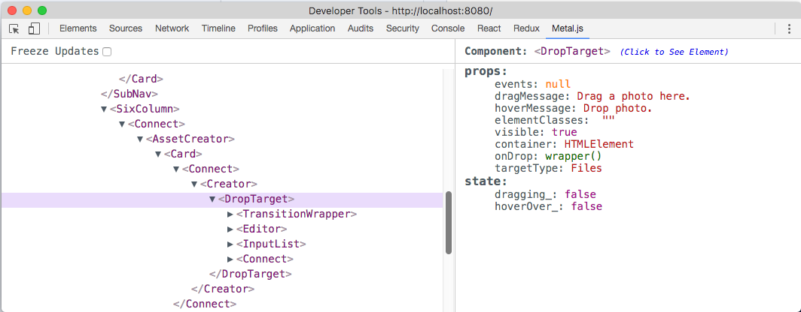

# metal-devtools

### Installation
* Download latest `metal-devtools.crx` from [releases](https://github.com/metal/metal-devtools/releases)
* Open Chrome and navigate to `chrome://extensions/`
* Drag `metal-devtools.crx` into extensions
* See how it works by using it [here](https://metal.github.io/metal-devtools/)

### Seeing Errors?
If you happen to see any errors or logs in your console that look like?

Please report these [here](https://github.com/metal/metal-devtools/issues/new)

### Developing
* Clone Repo
* run `npm install` at root

###### Chrome
* Run `npm run build`(this builds both the injected files and extension files)
* Navigate to `shells/chrome`
* Open Chrome and navigate to `chrome://extensions/`
* Click on "Load unpacked extension" and select this project directory

### For Metal.js < v2.6.2
Unfortunately if you are not using metal@v2.6.2 or greater, you need to manually add hook. See example [here](https://github.com/metal/metal.js/commit/06b837b9e2e6b072e66064308476d2f7661fa09c)
