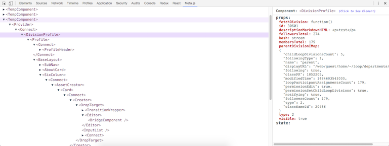

# metal-dev-tools

### Installation

* Clone Repo
* run `npm install`
* run `npm run build` or `npm run watch` for developing
* Go to Chrome and open extensions pane
* Click on "Load unpacked extension" and select this project

### For Metal.js < v2.6.1
Unfortunately if you are not using metal@v2.6.1 or greater, you need to manually add hook to `metal-component`.

To do so, see https://github.com/metal/metal.js/commit/8eaf85604c0d06eb5704ca11ef0ef1dbce2dccae for reference
